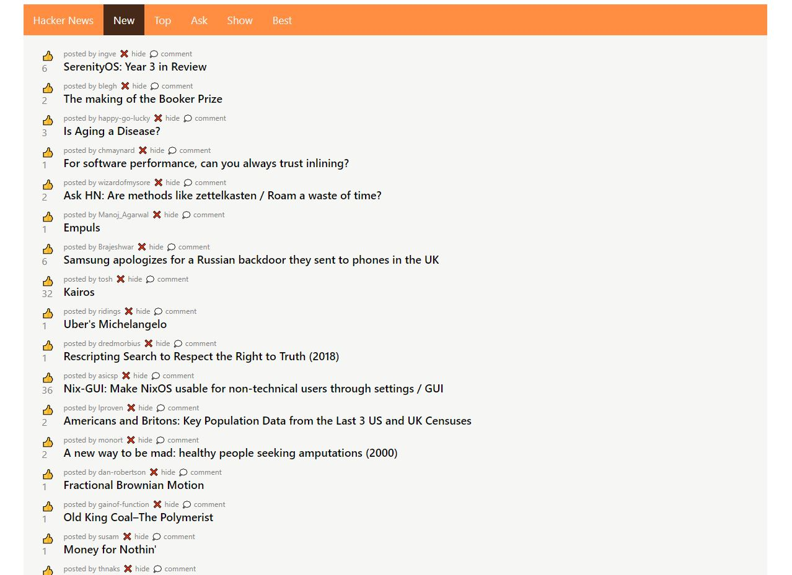

# Hacker News

This is Hacker news client built using Svelte.js

Purpose of this project is to get taste of Svelte framework.
App is built using openly available [API](https://github.com/HackerNews/API)

## Things I Wish I Could Do

`Login` - api dosn't have login endpoints so  this app is limited to read only.

`Pagination` - sadly api is not optimized for these kind of pages (sry for loading time).

## Gettings started

`yarn dev` - starts dev server

`yarn start` - starts web server

`yarn build` - bundles project